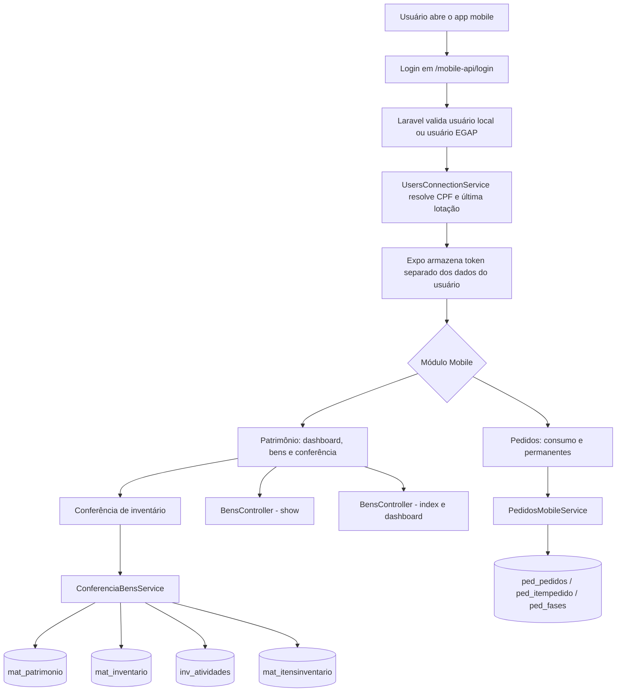
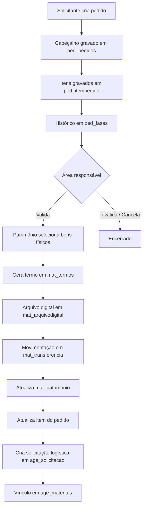
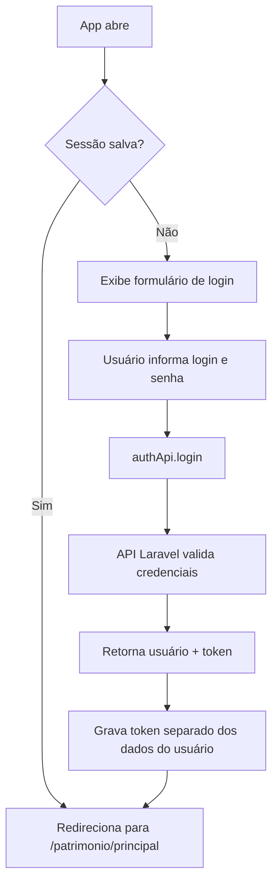

# 🗂️ EGAP e Inventário Mobile

> Repositório com duas aplicações integradas para gestão patrimonial, conferência de inventário e solicitação de materiais.

| Aplicação | Tecnologia | Finalidade |
|---|---|---|
| `egap` | Laravel 11 + Filament 3 | Administração patrimonial, pedidos, almoxarifado, relatórios e agendamento |
| `inventario-mobile` | Expo / React Native | Consulta, conferência patrimonial e criação de pedidos em campo |

O mobile consome a API Laravel em `/mobile-api`, autenticada com **Laravel Sanctum**. O Laravel é a fonte de verdade para autenticação, escopo do usuário, regras patrimoniais, conferência de inventário e pedidos.

---

## 📁 Estrutura do Repositório

```text
.
├── docs/                 # Documentos acadêmicos e materiais de apoio
├── egap/                 # Aplicação Laravel/Filament principal
└── inventario-mobile/    # Aplicação Expo/React Native
```

Os diretórios das aplicações também possuem READMEs curtos, voltados à execução de cada componente. Este arquivo concentra a arquitetura integrada e os contratos entre backend e mobile.

---

## 🔄 Visão Geral do Fluxo



---

## 🛠️ Tecnologias

### Backend Desktop / API

| Tecnologia | Versão |
|---|---|
| PHP | `^8.2` |
| Laravel | `^11` |
| Filament | `3.3` |
| Laravel Sanctum | `^4` |
| Banco de dados | MySQL / MariaDB (legado/patrimônio em `egap`; autenticação local em `emes`) |
| Assets | Vite |
| Qualidade | PHPUnit + Laravel Pint |

### Mobile

| Tecnologia | Versão |
|---|---|
| Expo | `~54` |
| React | `19` |
| React Native | `0.81` |
| Expo Router | `~6` |
| TypeScript | `~5.9` |
| `expo-camera` | Leitura de código de barras |
| `expo-secure-store` | Token e sessão local |
| `react-native-gesture-handler` | Menu lateral / gestos |

---

## 🖥️ EGAP Desktop

O EGAP desktop fica no diretório `egap` e registra um painel Filament em `/egap`.

**Configuração principal:**

| Parâmetro | Valor |
|---|---|
| Provider | `egap/app/Providers/Filament/EgapPanelProvider.php` |
| Panel ID | `egap` |
| Path | `/egap` |
| Auth guard | `pessoa` |
| Login customizado | `App\Filament\Auth\LoginEgap` |
| SPA | habilitado via `->spa()` |

### Módulos Principais do Desktop

| Módulo | Funcionalidades |
|---|---|
| **Painel de Controle** | Dashboard administrativo com indicadores patrimoniais |
| **Cadastro** | Setores, fornecedores, marcas, modelos, conta contábil, centro de custo, situação do bem e unidades de medida |
| **Patrimônio** | Bens móveis, imóveis e intangíveis; incorporação, transferência, baixa, termos, inventário, depreciação, conciliação e reavaliação |
| **Pedidos** | Solicitação, validação, atendimento patrimonial e agendamento de entrega/recolhimento |
| **Almoxarifado** | Notas fiscais, movimentação de estoque, pedidos e situações |
| **Agendamento** | Frota, equipes, regiões, transporte e solicitações |
| **Processo** | Processos administrativos, materiais e tipos de documento/processo |
| **Relatórios Gerais** | Relatórios TCE, bens móveis, bens imóveis, almoxarifado, pedidos e bens permanentes |
| **Portal Transparência** | Página de indicadores públicos/gerenciais |
| **Administração** | Usuários, lotações e permissões |

### Dashboard Desktop

**Arquivo principal:**

```text
egap/app/Filament/Pages/EgapDashboard.php
```

**Widgets utilizados:**

- `PatrimonioOverviewStats`
- `PatrimonioMoveisPorSituacaoChart`
- `PatrimonioMoveisPorAnoChart`
- `PatrimonioImoveisPorContaChart`
- `PatrimonioTopMateriaisValorTable`

Os indicadores são calculados por:

```text
egap/app/Services/PatrimonioDashboardService.php
```

O dashboard aceita filtro por período de incorporação, aplicado a bens móveis (`mat_patrimonio.DatadeIncorporacao`) e imóveis (`imo_imovel.data_incorporacao`).

### Fluxo Pedidos → Patrimônio

O fluxo desktop mais importante integra pedidos, patrimônio e logística:



> ⚠️ **Pontos de atenção:**
> - O setor de Patrimônio aparece em regras como ID `1239`.
> - Depósitos de bens disponíveis usam complementos específicos.
> - Atendimento exige quantidade de bens selecionados igual à quantidade pendente.
> - Histórico funcional deve ser gravado em `ped_fases`.
> - Algumas regras ainda dependem de IDs fixos e views legadas.

---

## 📱 Aplicativo Mobile

O mobile fica em `inventario-mobile` e usa Expo Router com rotas baseadas em arquivos. Os módulos disponíveis atualmente são **Patrimônio** e **Pedidos**.

### Estrutura Mobile

```text
inventario-mobile/
├── app/
│   ├── _layout.tsx              # Layout raiz, ThemeProvider e GestureHandlerRootView
│   ├── index.tsx                # Login
│   ├── erro.tsx                 # Tela global para falhas de rede/servidor
│   ├── patrimonio/
│   │   ├── _layout.tsx          # Stack interno e menu lateral por gesto
│   │   ├── index.tsx            # Redirect para /patrimonio/principal
│   │   ├── principal.tsx        # Painel principal patrimonial
│   │   ├── bens.tsx             # Lista paginada de bens do setor
│   │   └── conferencia.tsx      # Conferência de inventário
│   └── pedidos/
│       ├── _layout.tsx          # Stack do módulo e menu lateral por gesto
│       ├── index.tsx            # Redirect para /pedidos/consumo
│       ├── consumo.tsx          # Solicitação de bens de consumo
│       └── permanentes.tsx      # Solicitação de bens permanentes
├── components/
│   ├── app-sidebar.tsx          # Menu lateral por módulo
│   ├── app-menu-button.tsx      # Botão de abertura do menu
│   ├── bottom-bar.tsx           # Navegação inferior do patrimônio
│   └── pedidos/
│       └── pedidos-carrinho-screen.tsx # Catálogo, carrinho e envio de pedidos
├── src/
│   ├── api/                     # Cliente HTTP e contratos de patrimônio/pedidos
│   ├── config/env.ts            # Variáveis EXPO_PUBLIC_*
│   ├── errors/                  # Eventos globais de falhas de API
│   ├── navigation/              # Direção das animações do stack patrimônio
│   └── storage/                 # Sessão multiplataforma e histórico local
└── app.json                     # Config Expo, plugins e permissões
```

### Rotas Mobile

| Rota | Descrição |
|---|---|
| `/` | Tela de login |
| `/patrimonio` | Redireciona para `/patrimonio/principal` |
| `/patrimonio/principal` | Painel de resumo, consulta de patrimônio, leitura por câmera e últimas consultas |
| `/patrimonio/bens` | Lista de bens vinculados ao setor do usuário |
| `/patrimonio/conferencia` | Conferência de inventário do setor |
| `/pedidos` | Redireciona para `/pedidos/consumo` |
| `/pedidos/consumo` | Catálogo e envio de pedido de materiais de consumo |
| `/pedidos/permanentes` | Catálogo e envio de pedido de bens permanentes |
| `/erro` | Tela exibida para falhas de rede ou erros de servidor reportados pelo cliente HTTP |

### Navegação Mobile

O app usa duas formas principais de navegação:

- **Barra inferior** (`BottomBar`) — Dashboard, Bens e Conferência, disponível no módulo Patrimônio.
- **Menu lateral** (`AppSidebar`) — módulos funcionais Patrimônio e Pedidos; Processos e Relatórios permanecem indicados como futuros.

O logout é realizado pelo menu lateral ou pelo botão no dashboard patrimonial. Os layouts de `patrimonio` e `pedidos` permitem abrir o menu lateral por gesto de arrasto na borda esquerda.

As transições entre telas de patrimônio usam:

```text
inventario-mobile/src/navigation/patrimonioNavigation.ts
```

### Login e Sessão

**Arquivo:** `inventario-mobile/app/index.tsx`



**Arquivos envolvidos:**

- `inventario-mobile/src/api/auth.ts`
- `inventario-mobile/src/api/client.ts`
- `inventario-mobile/src/config/env.ts`
- `inventario-mobile/src/storage/appStorage.ts`

**Dados salvos localmente:**

- `auth_token` — token Sanctum armazenado separadamente.
- `auth_user` — dados do usuário, sem o token em texto.
- `recent_bens:{userId}`

Em Android/iOS, `appStorage` usa `expo-secure-store`; na execução web, usa `localStorage` com fallback em memória. A rota `/me` valida a sessão e atualiza os dados do usuário, mas não retorna o token.

### Cliente HTTP Mobile

**Arquivo:** `inventario-mobile/src/api/client.ts`

**Responsabilidades:**

- Ler `ENV.API_URL`.
- Montar headers `Content-Type`, `Accept`, `Authorization` e `ngrok-skip-browser-warning`.
- Guardar/remover token por `appStorage`.
- Converter respostas HTTP com erro em `ApiError`.
- Converter falhas de rede em `NetworkError`.
- Encaminhar falhas de rede e respostas HTTP `5xx` para a tela global `/erro`.

**Variáveis de ambiente:**

```text
EXPO_PUBLIC_API_URL=https://seu-ngrok-ou-host/mobile-api
```

`EXPO_PUBLIC_EGAP_API_URL` ainda é aceito como fallback legado quando `EXPO_PUBLIC_API_URL` não está definida. `EXPO_PUBLIC_USE_MOCK_API` é lida pela configuração atual, mas não há implementação de transporte mock no cliente HTTP.

> Durante desenvolvimento com ngrok, se a URL mudar, atualize somente `.env.local` do mobile.

### Painel Principal Mobile

**Arquivo:** `inventario-mobile/app/patrimonio/principal.tsx`

**Funcionalidades:**

- Valida sessão com `/me`.
- Carrega dashboard mobile via `/dashboard`.
- Mostra dados do usuário, unidade e setor.
- Exibe indicadores de bens, valores e andamento de conferência.
- Permite consulta manual de patrimônio.
- Permite leitura por câmera usando `expo-camera`.
- Abre modal de detalhes do bem consultado.
- Mantém histórico local das últimas 5 consultas.
- Reconsulta um item do histórico ao tocar nele.
- Atualiza histórico e dashboard quando a tela volta ao foco.

**Dados exibidos no modal do bem:**

- Patrimônio atual e anterior, Tombo SMARAPD, número de série.
- Descrição, marca, modelo e tipo.
- Situação.
- Unidade, setor, complemento e andar.
- Valores, documentos e datas.
- Baixa e observação (quando existirem).

### Lista de Bens do Setor

**Arquivo:** `inventario-mobile/app/patrimonio/bens.tsx`

**Funcionalidades:**

- Carrega bens do setor autenticado.
- Usa paginação (`per_page = 30`).
- Permite busca por patrimônio, descrição, marca ou série.
- Suporta pull-to-refresh.
- Carrega mais itens ao final da lista.
- Mostra total de bens retornado pela API.

**API consumida:**

```text
GET /mobile-api/bens?page=1&per_page=30&search=...
```

### Pedidos Mobile

**Arquivos principais:**

- `inventario-mobile/components/pedidos/pedidos-carrinho-screen.tsx`
- `inventario-mobile/src/api/pedidos.ts`
- `egap/app/Http/Controllers/Api/PedidosController.php`
- `egap/app/Services/Mobile/PedidosMobileService.php`

**Funcionalidades:**

- Oferece abas de pedidos de **consumo** e **permanentes**.
- Busca materiais visíveis para a unidade, com paginação e seleção de quantidades.
- Carrega complementos de setor e exige um destino para o pedido.
- Monta carrinho e envia o pedido diretamente para a API.
- Em consumo, exige justificativa geral e encaminha o pedido ao Almoxarifado.
- Em permanentes, exige justificativa por item, aceita adição ou substituição e exige o patrimônio substituído quando aplicável.

**Regras de persistência:**

- Novos pedidos são gravados com situação inicial `6` (em análise).
- Consumo utiliza setor responsável `799` (Almoxarifado); permanentes utilizam `1239` (Patrimônio).
- A criação grava cabeçalho em `ped_pedidos`, itens em `ped_itempedido` e histórico em `ped_fases`, dentro de transação na conexão `egap`.
- A listagem `GET /mobile-api/pedidos` existe na API para pedidos do usuário, ainda que as telas atuais estejam concentradas no cadastro pelo carrinho.

### Conferência de Inventário

**Arquivo:** `inventario-mobile/app/patrimonio/conferencia.tsx`

**Funcionalidades:**

- Carrega inventário atual, atividade do setor, resumo e bens esperados.
- Mostra métricas: total, localizados, pendentes, não localizados, divergentes, transferência e manuais.
- Filtra lista por status.
- Valida leitura manual ou por câmera.
- Permite confirmar localização.
- Permite registrar bem não localizado com justificativa.
- Permite registrar divergência com campos e observação.
- Permite declarar divergência para código lido sem cadastro patrimonial digital.
- Permite finalizar conferência quando a API indicar `pode_finalizar`.
- Bloqueia ações quando a atividade está finalizada/bloqueada.

**Status usados no mobile:**

| Status | Descrição |
|---|---|
| `pendente` | Bem ainda não conferido |
| `localizado` | Bem encontrado e confirmado |
| `nao_localizado` | Bem não encontrado (requer justificativa) |
| `divergente` | Bem com divergência (requer observação) |
| `em_transferencia` | Bem em processo de transferência |
| `cadastrado_manualmente` | Registro manual |
| `registrado` | Registrado na conferência |

**Resultados possíveis de leitura:**

- `localizavel`, `ja_conferido`, `outro_setor`, `nao_cadastrado`, `situacao_nao_conferivel`, `em_transferencia`, `cadastrado_manualmente`

Quando um código sem cadastro já foi registrado como divergente no inventário atual, uma nova leitura retorna `ja_conferido`, evitando duplicidade.

---

## 🌐 API Mobile Laravel

**Arquivo de rotas:** `egap/routes/api.php` | **Prefixo:** `/mobile-api`

### Rotas Públicas

| Método | Rota | Controller | Função |
|---|---|---|---|
| `POST` | `/mobile-api/login` | `MobileAuthController` | Autentica e gera token mobile |

### Rotas Protegidas (`auth:sanctum`)

| Método | Rota | Controller | Função |
|---|---|---|---|
| `GET` | `/mobile-api/me` | `MobileAuthController` | Valida sessão/token |
| `POST` | `/mobile-api/logout` | `MobileAuthController` | Revoga token atual |
| `GET` | `/mobile-api/dashboard` | `BensController` | Resumo patrimonial do setor |
| `GET` | `/mobile-api/bens` | `BensController` | Lista bens do setor |
| `GET` | `/mobile-api/bens/{numPatrimonio}` | `BensController` | Consulta patrimônio por código |
| `GET` | `/mobile-api/pedidos` | `PedidosController` | Lista pedidos do usuário |
| `GET` | `/mobile-api/pedidos/contexto` | `PedidosController` | Resolve escopo e complementos disponíveis |
| `GET` | `/mobile-api/pedidos/materiais` | `PedidosController` | Lista materiais de consumo ou permanentes |
| `POST` | `/mobile-api/pedidos` | `PedidosController` | Cria pedido e itens |
| `GET` | `/mobile-api/conferencia/atual` | `ConferenciaBensController` | Inventário/atividade/resumo |
| `GET` | `/mobile-api/conferencia/bens` | `ConferenciaBensController` | Bens esperados no setor |
| `POST` | `/mobile-api/conferencia/validar-leitura` | `ConferenciaBensController` | Valida código lido |
| `POST` | `/mobile-api/conferencia/localizar` | `ConferenciaBensController` | Confirma localização |
| `POST` | `/mobile-api/conferencia/nao-localizados` | `ConferenciaBensController` | Registra não localizado |
| `POST` | `/mobile-api/conferencia/divergencias` | `ConferenciaBensController` | Registra divergência |
| `POST` | `/mobile-api/conferencia/finalizar` | `ConferenciaBensController` | Finaliza atividade do setor |

**Comando útil:**

```powershell
cd egap
php artisan route:list --path=mobile-api
```

### Autenticação Mobile

**Controller:** `egap/app/Http/Controllers/Api/MobileAuthController.php`

**Fluxo:**

1. Recebe `login` e `password`.
2. Tenta autenticar usuário local (`users`) por login, email ou CPF.
3. Se não encontrar, tenta autenticar usuário EGAP (`UserEgap`) por username ou email.
4. Valida senha com `Hash::check`.
5. Usa `UsersConnectionService` para resolver vínculo mobile.
6. Gera token Sanctum com nome `mobile-app`.
7. Retorna usuário normalizado e token somente na resposta de login.

Nas chamadas subsequentes, `GET /mobile-api/me` retorna os dados normalizados do usuário sem expor novamente o token. No aplicativo, `auth_token` e `auth_user` permanecem armazenados separadamente.

**Serviço de vínculo:** `egap/app/Services/UsersConnectionService.php`

Esse serviço cruza: usuário local (`users`), CPF normalizado, `InfoUser`, usuário EGAP, última lotação em `mat_lotacao`, unidade judiciária e setor.

> O Expo **nunca** envia setor/unidade como fonte de verdade. A API sempre resolve o escopo pelo token.

### Consulta de Bens

**Controller:** `egap/app/Http/Controllers/Api/BensController.php`

**Regras principais:**

- Situações elegíveis para bens do setor: `1`, `7`, `8`.
- A listagem `/bens` filtra por `UnidadeJudiciaria`, `Setor` e `SituacaoBem IN (1, 7, 8)`.
- A consulta direta `/bens/{numPatrimonio}` busca por código patrimonial, tombo, tombo SMARAPD ou patrimônio anterior, normalizando espaços, caracteres não numéricos e zeros à esquerda.
- O retorno inclui `scope.belongs_to_user_scope` e `scope.situacao_elegivel`.

**Campos retornados por bem:** `id`, `patrimonio`, `patrimonio_anterior`, `tombo_smarapd`, `num_tombo_smarapd`, `numero_serie`, `descricao`, `descricao_resumida`, `marca`, `modelo`, `tipo_bem`, `estado_conservacao`, `voltagem`, `situacao`, `unidade_judiciaria`, `setor`, `complemento_setor`, `andar_setor`, `valor_aquisicao`, `valor`, datas e documentos de incorporação/cadastro/baixa/processo/empenho/liquidação, `observacao`.

### Dashboard Mobile

**Endpoint:** `GET /mobile-api/dashboard`

**Retorna:**

- Escopo do usuário.
- Total de bens elegíveis do setor.
- Distribuição por situação patrimonial.
- Resumo financeiro: valor de aquisição, valor atual, bens sem valor e quantidade avaliada.
- Dados de conferência atual, quando existir inventário acessível.

### Pedidos no Backend

**Controller:** `egap/app/Http/Controllers/Api/PedidosController.php`

**Serviço:** `egap/app/Services/Mobile/PedidosMobileService.php`

**Responsabilidades:** resolver escopo do solicitante; listar complementos; filtrar materiais visíveis para a unidade; consultar estoque/preço de referência; listar pedidos já criados; validar e persistir novos pedidos de consumo ou permanentes.

**Parâmetros principais da API:**

| Endpoint | Parâmetros |
|---|---|
| `GET /mobile-api/pedidos/materiais` | `tipo=consumo\|permanente`, `search`, `page`, `per_page` |
| `GET /mobile-api/pedidos` | `page`, `per_page` |
| `POST /mobile-api/pedidos` | `tipo`, `complemento_setor_id`, `justificativa`, `itens[]` |

### Conferência de Bens no Backend

**Controller:** `egap/app/Http/Controllers/Api/ConferenciaBensController.php`

**Serviço:** `egap/app/Services/Mobile/ConferenciaBensService.php`

**Responsabilidades do serviço:** localizar inventário atual; localizar ou criar atividade do setor; listar bens esperados; associar cada bem ao item de inventário; validar leituras; confirmar localização; registrar não localizado; registrar divergência; recalcular resumo; finalizar atividade.

**Status gravados:** `LOCALIZADO`, `NAO LOCALIZADO` (encoding legado), `DIVERGENTE`, `A INVENTARIAR`.

> ⚠️ **Regras importantes:**
> - Escritas usam transação na conexão `egap`.
> - O backend impede duplicidade de item no inventário.
> - Atividade finalizada ou com carga efetuada bloqueia edições.
> - Um código sem bem cadastrado pode gerar item divergente com `id_bem = null`, preservando o número lido.
> - `mat_patrimonio.sit_inventario` e `mat_patrimonio.id_inventario` são atualizados para compatibilidade com o legado.
> - `mat_itensinventario` é a fonte principal do registro da conferência atual.

---

## 🗃️ Modelo de Dados Relevante

| Tabela | Model | Papel |
|---|---|---|
| `users` | `App\Models\User` | Usuário local Laravel/Sanctum (conexão `emes`) |
| `jos_users` / equiv. EGAP | `App\Models\UserEgap` | Usuário do sistema EGAP legado |
| `mat_lotacao` | `App\Models\Admin\Lotacao` | Unidade/setor vigente do usuário |
| `mat_patrimonio` | `BemMovel` | Cadastro principal de bens móveis |
| `mat_inventario` | `Inventario` | Ciclos de inventário |
| `inv_atividades` | `AtividadeInventario` | Status da conferência por unidade/setor |
| `mat_itensinventario` | `ItemInventario` | Apontamentos da conferência |
| `mat_transferencia` | `TransferenciaBemMovel` | Histórico de movimentação |
| `mat_termos` | `Termo` | Termos de responsabilidade |
| `mat_arquivodigital` | `ArquivoDigital` | Arquivos/validação de termos |
| `mat_setores` | `Setores` | Unidades e setores |
| `mat_complementosetor` | `ComplementoSetor` | Complementos físicos/lógicos do setor |
| `ped_pedidos` | `Pedidos` | Cabeçalho das solicitações de materiais |
| `ped_itempedido` | `ItemPedido` | Materiais e quantidades solicitados |
| `ped_fases` | `FasePedido` | Histórico funcional do pedido e seus itens |

---

## ⚙️ Configuração e Execução

### Backend Laravel

```powershell
# 1. Entrar no projeto
cd egap

# 2. Instalar dependências PHP
composer install

# 3. Instalar dependências JS
npm install

# 4. Configurar .env
APP_NAME=EGAP
APP_ENV=local
APP_URL=http://localhost

DB_CONNECTION=mysql
DB_HOST=127.0.0.1
DB_PORT=3306
DB_DATABASE=patrimonio
DB_USERNAME=admin
DB_PASSWORD=admin

# Se a conexão legada usar credenciais ou banco diferentes:
# EGAP_DB_DATABASE=patrimonio
# EGAP_DB_USERNAME=admin
# EGAP_DB_PASSWORD=admin

# 5. Rodar migrations (quando necessário)
php artisan migrate

# 6. Subir Laravel
php artisan serve

# 7. Em outro terminal, subir assets
npm run dev
```

> Acesse o desktop em: `http://127.0.0.1:8000/egap`

> Serviços, relatórios e transações patrimoniais chamam explicitamente `DB::connection('egap')`, configurada por `EGAP_DB_*` com fallback em `DB_*`. O model `App\Models\User` usa a conexão `emes`, cujo banco atual é `emes` com host e credenciais `DB_*`; migrations e tabelas do Sanctum usadas por autenticação local devem existir nesse banco.

### API Mobile com Ngrok

Se o Expo estiver em celular físico, exponha o Laravel local:

```powershell
ngrok http 8000
```

Depois atualize `inventario-mobile/.env.local`:

```text
EXPO_PUBLIC_API_URL=https://seu-subdominio.ngrok-free.dev/mobile-api
```

> O cliente mobile envia o header `ngrok-skip-browser-warning: 1` automaticamente.

### Mobile Expo

```powershell
# 1. Entrar no app
cd inventario-mobile

# 2. Instalar dependências
npm install

# 3. Iniciar Expo
npm run start

# Atalhos por plataforma
npm run android
npm run ios
npm run web
```

> **Windows:** se o PowerShell bloquear `npm.ps1` ou `npx.ps1`, use:
> ```powershell
> npm.cmd run start
> npx.cmd expo start
> ```

---

## ✅ Validação e Qualidade

### Backend

```powershell
cd egap
php artisan test
vendor\bin\pint --test
php -l app/Http/Controllers/Api/BensController.php
```

### Mobile

```powershell
cd inventario-mobile
npm.cmd run lint
npx.cmd tsc --noEmit
```

---

## 📋 Contratos Resumidos da API Mobile

### Login

```http
POST /mobile-api/login
Content-Type: application/json
```

```json
{
  "login": "usuario",
  "password": "senha"
}
```

**Resposta de sucesso:**

```json
{
  "message": "Login realizado com sucesso.",
  "user": {
    "id": 1,
    "idEgap": 10,
    "login": "usuario",
    "name": "Nome do Usuario",
    "email": "usuario@example.com",
    "unidade_judiciaria": 100,
    "setor": 200,
    "token": "plain-text-sanctum-token"
  }
}
```

### Listagem de Bens

```http
GET /mobile-api/bens?page=1&per_page=30&search=notebook
Authorization: Bearer {token}
```

```json
{
  "scope": {
    "user_id": 1,
    "id_egap": 10,
    "setor": 200,
    "unidade_judiciaria": 100
  },
  "total": 123,
  "bens": [],
  "meta": {
    "current_page": 1,
    "per_page": 30,
    "total": 123,
    "last_page": 5,
    "from": 1,
    "to": 30,
    "has_more": true
  }
}
```

### Consulta Direta de Patrimônio

```http
GET /mobile-api/bens/{numPatrimonio}
Authorization: Bearer {token}
```

```json
{
  "bem": {
    "id": 1,
    "patrimonio": "12345",
    "descricao": "Descricao do bem"
  },
  "scope": {
    "belongs_to_user_scope": true,
    "situacao_elegivel": true
  }
}
```

### Criação de Pedido Permanente

```http
POST /mobile-api/pedidos
Authorization: Bearer {token}
Content-Type: application/json
```

```json
{
  "tipo": "permanente",
  "complemento_setor_id": 20,
  "itens": [
    {
      "material_id": 45,
      "quantidade": 1,
      "tipo_atendimento": "substituicao",
      "justificativa": "Equipamento sem condições de uso.",
      "patrimonio_substituido": "12345"
    }
  ]
}
```

Para `tipo=consumo`, cada item requer apenas `material_id` e `quantidade`, e o campo geral `justificativa` é obrigatório.

### Conferência Atual

```http
GET /mobile-api/conferencia/atual
Authorization: Bearer {token}
```

```json
{
  "inventario": {
    "id": 1,
    "numero": 1,
    "ano": 2026,
    "situacao": "Em andamento"
  },
  "atividade": {
    "id": 10,
    "unidade_judiciaria": 100,
    "setor": 200,
    "situacao": "Em andamento",
    "pode_editar": true,
    "pode_finalizar": false
  },
  "resumo": {
    "total": 100,
    "localizados": 70,
    "pendentes": 20,
    "nao_localizados": 5,
    "divergentes": 3,
    "outro_setor": 0,
    "em_transferencia": 2,
    "cadastrados_manualmente": 0,
    "pode_finalizar": false
  }
}
```

---

## 📏 Regras de Negócio Importantes

> ⚠️ Leia com atenção antes de qualquer modificação no backend ou mobile.

- O backend é a **única fonte confiável** para setor, unidade e usuário.
- O app mobile **não deve enviar** setor/unidade para decidir escopo.
- Bens do setor usam `UnidadeJudiciaria`, `Setor` e `SituacaoBem IN (1, 7, 8)`.
- Consulta direta por patrimônio busca no cadastro geral e informa se pertence ao escopo do usuário.
- Confirmar localização cria/atualiza dados de inventário em transação.
- Não localizado **exige justificativa**.
- Divergência **exige observação**.
- Código lido sem cadastro pode ser registrado como divergência sem criar um bem patrimonial.
- Atividade finalizada **bloqueia** novas escritas.
- Finalização só deve ocorrer quando `pode_finalizar = true`.
- Pedidos de consumo exigem justificativa geral; pedidos permanentes exigem justificativa por item e patrimônio em caso de substituição.
- O token Sanctum é persistido separado de `auth_user` e não é retornado pelo endpoint `/me`.
- Histórico local do mobile é conveniência de interface; **não substitui** auditoria no banco.

---

## 🔍 Pontos de Atenção Técnica

- Existem textos no projeto com encoding antigo; ao editar arquivos, manter o padrão do arquivo e evitar introduzir mojibake novo.
- Algumas regras do desktop dependem de **IDs fixos** de setor/complemento/situação. Documente qualquer novo uso desses IDs.
- O fluxo de atendimento de pedidos usa histórico em `ped_fases`; novas automações devem preservar esse histórico.
- A numeração de termos baseada em `max(num_termo) + 1` merece cuidado em **concorrência**.
- Views legadas podem conter filtros de negócio embutidos.
- Diversos fluxos usam `DB::connection('egap')`; remover ou renomear essa conexão quebra relatórios, pedidos e conferência.
- Os scripts `migrar_jos_users_para_users*.sql` usam `USE patrimonio`; com `users` em `emes`, ajuste ou qualifique a tabela de destino antes da execução.
- Em execução web, o armazenamento mobile usa `localStorage`; em dispositivos nativos, usa `expo-secure-store`.
- O mobile usa ngrok em desenvolvimento; URL expirada causa erro de rede no app.

---
