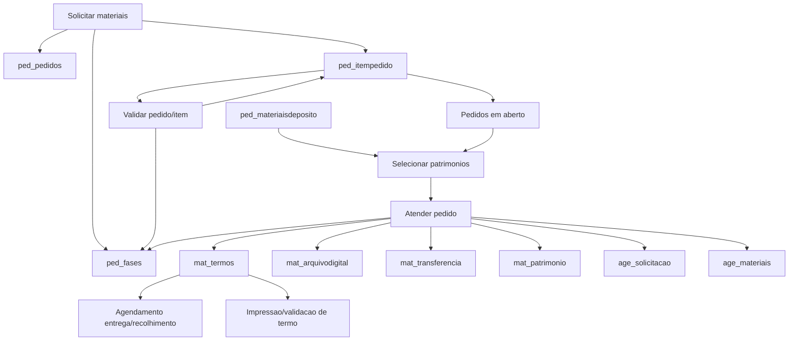

# Relatorio do fluxo de Patrimonio e Pedidos do EGAP

Gerado em 2026-05-12 a partir do projeto local `C:\dev\emes` e do banco MySQL `egap`.

## 1. Escopo analisado

Este relatorio cobre o fluxo de Pedidos de materiais permanentes que desemboca em Patrimonio, principalmente bens moveis. A implementacao atual combina:

- Painel Filament EGAP em `/emes/egap`.
- Cluster `Pedidos`, onde ficam solicitacao, validacao, atendimento, historico, relatorio e agendamento de entrega/recolhimento.
- Cluster/Resources de `Patrimonio`, principalmente bens moveis, termos, transferencias e validacao de termos.
- Banco legado `egap`, com tabelas `ped_*`, `mat_*` e `age_*`.

Arquivos mais relevantes:

- `app/Providers/Filament/EgapPanelProvider.php`
- `app/Filament/Egap/Clusters/PedidosCluster.php`
- `app/Filament/Egap/Clusters/PedidosCluster/Requisicao/SolicitarMateriais.php`
- `app/Filament/Egap/Resources/Pedidos/ValidarPedidoResource.php`
- `app/Filament/Egap/Clusters/PedidosCluster/AtendimentoPedidosPage.php`
- `app/Filament/Egap/Livewire/AtendimentoPedidos/PedidosEmAbertoTable.php`
- `app/Filament/Egap/Livewire/AtendimentoPedidos/MateriaisDisponiveisTable.php`
- `app/Filament/Egap/Clusters/PedidosCluster/AgendamentoEntregaRecolhimento.php`
- `app/Filament/Egap/Resources/Patrimonio/BensMoveis/BemMovelResource.php`
- `app/Filament/Egap/Resources/Patrimonio/BensMoveis/TermoResource.php`
- `app/Filament/Egap/Resources/Patrimonio/BensMoveis/TransferenciaBemResource.php`
- `app/Filament/Egap/Resources/Patrimonio/BensMoveis/ValidarTermoResource.php`
- `app/Http/Controllers/TermosPrintController.php`
- `app/Http/Controllers/PedidosPrintController.php`

## 2. Arquitetura geral

O sistema e Laravel 11 com Filament v3 e Livewire v3. O painel EGAP e registrado em `EgapPanelProvider` com:

- ID do painel: `egap`.
- Caminho: `/emes/egap`.
- Guard: `pessoa`.
- Auto-descoberta de resources, pages, clusters e widgets em `app/Filament/Egap`.
- Grupos de navegacao: Painel de Controle, Cadastro, Pedidos, Almoxarifado, Bens Imoveis, Bens Intangiveis, Bens Moveis, Agendamento e Administracao.

A conexao EGAP e separada no Laravel:

- Conexao: `egap`.
- Banco: `egap`.
- Driver: MySQL.
- Observacao tecnica: em `config/database.php`, a conexao `egap` usa `password => env('DB_PASSWORD', '')`, nao `DB_EGAP_PASSWORD`. No `.env` atual isso funciona porque `DB_PASSWORD=admin`.

## 3. Mapa funcional do fluxo

Fluxo resumido:

1. Solicitante cria um pedido de material permanente.
2. O pedido grava cabecalho em `ped_pedidos`.
3. Cada material grava um item em `ped_itempedido`.
4. O sistema grava eventos/historico em `ped_fases`.
5. A area responsavel valida, invalida, cancela, suspende ou atualiza itens.
6. Patrimonio atende itens validados/em analise selecionando bens fisicos disponiveis no deposito.
7. O atendimento gera termo em `mat_termos`, arquivo digital em `mat_arquivodigital`, transferencia em `mat_transferencia`, atualiza o bem em `mat_patrimonio`, atualiza o item do pedido e cria solicitacao logistica em `age_solicitacao`/`age_materiais`.
8. O fluxo de agendamento gerencia entrega/recolhimento vinculado ao termo.
9. Termos podem ser visualizados, impressos e validados em recursos de patrimonio.

Diagrama logico:



## 4. Banco de dados: tabelas e volumes

Banco `egap` possui 311 tabelas e aproximadamente 0,94 GB.

Tabelas centrais do fluxo:

| Tabela/View | Registros | Papel |
|---|---:|---|
| `ped_pedidos` | 33.262 | Cabecalho do pedido |
| `ped_itempedido` | 206.447 | Itens/material solicitado |
| `ped_fases` | 6.118 | Historico do fluxo de pedido/item/termo |
| `ped_situacao` | 12 | Situacoes do pedido/item |
| `ped_atendimentopedidos` | 452 | View de itens abertos para atendimento |
| `ped_materiaisdeposito` | 523 | View de bens disponiveis em deposito |
| `mat_patrimonio` | 185.593 | Bens moveis patrimoniais |
| `mat_transferencia` | 1.225.169 | Historico de movimentacao/transferencia dos bens |
| `mat_termos` | 168.886 | Termos de responsabilidade |
| `mat_arquivodigital` | 128.715 | Arquivos digitais/anexos de termos |
| `age_solicitacao` | 37.504 | Solicitacoes de agendamento/logistica |
| `age_materiais` | 9.678 | Vinculo entre pedido, termo e solicitacao logistica |

## 5. Situacoes de pedido

Tabela `ped_situacao`:

| ID | Descricao | Pedidos | Itens |
|---:|---|---:|---:|
| 3 | Atendido | 26.865 | 5.302 |
| 4 | Cancelado | 231 | 2.331 |
| 5 | Invalidado | 0 | 3.050 |
| 6 | Em analise | 367 | 345 |
| 7 | Validado | 5.798 | 194.967 |
| 8 | Agendado | 0 | 0 |
| 9 | Em atendimento | 0 | 434 |
| 10 | Suspenso | 0 | 0 |
| 11 | Devolvido | 0 | 0 |
| 12 | Concluido | 0 | 0 |
| 13 | Em revisao | 0 | 0 |
| 14 | Tacito | 0 | 0 |

No codigo novo, as constantes principais ficam em `SolicitarMateriais`:

- `3`: Atendido.
- `4`: Cancelado.
- `5`: Invalidado.
- `6`: Em analise.
- `7`: Validado.
- `9`: Em atendimento.
- `12`: Concluido.

## 6. Modelo de dados

### 6.1 Pedidos

Model: `App\Models\Egap\Almoxarifado\Pedidos`

Tabela: `ped_pedidos`

Campos principais:

- `id`
- `date_time`
- `Solicitante`
- `UnidadeJudiciaria`
- `Setor`
- `ComplementoSetor`
- `Observacao`
- `DataTermino`
- `ResponsavelAtendimento`
- `idSituacao`
- `num_protocolo`
- `arquivo`
- `justificativa`
- `setor_responsavel`

Relacionamentos:

- `itens()` -> `ped_itempedido.idPedido`.
- `fases()` -> `ped_fases.id_pedido`.
- `situacao()` -> `ped_situacao.id`.
- `solicitante_get()` -> `jos_users.id`.
- `responsavel_atendimento()` -> `jos_users.id`.
- `unidade_judiciaria()` -> `mat_setores.id`.
- `setor_get()` -> `mat_setores.id`.
- `setorResponsavel()` -> `mat_setores.id`.
- `complementoSetor()` -> `mat_complementosetor.id`.
- `termo()` -> `mat_termos.pedido_no`.

### 6.2 Itens do pedido

Model: `App\Models\Egap\Almoxarifado\ItemPedido`

Tabela: `ped_itempedido`

Campos principais:

- `id`
- `idPedido`
- `QuantidadeMaterial`
- `QuantidadeMaterialAtendida`
- `material`
- `DescricaoDetalhada`
- `situacao`
- `quantidade_validada`
- `valor_material`
- `data_validacao`, `validado_por`
- `data_cancelado`, `cancelado_por`
- `ObservacaoItem`
- `justificativa`

Relacionamentos:

- `pedido()` -> `ped_pedidos`.
- `materialRel()` -> `mat_descricaoresumida`.
- `descricaoDetalhadaRel()` -> `mat_descricaodetalhada`.
- `situacaoRef()` -> `ped_situacao`.
- `validadoPor()` e `canceladoPor()` -> `jos_users`.

Regras calculadas no model:

- `material_nome`: usa descricao detalhada, depois descricao resumida, depois texto padrao.
- `quantidade_pendente`: usa `quantidade_validada` quando maior que zero; senao usa `QuantidadeMaterial`; subtrai `QuantidadeMaterialAtendida`.
- `scopePendentes`: filtra itens com quantidade validada ou solicitada maior que atendida.

Observacao tecnica: no banco, `quantidade_validada` e `ped_fases.quantidade` sao `varchar(255)`, mas o codigo trata como inteiros.

### 6.3 Historico/fases

Model: `App\Models\Egap\Almoxarifado\FasePedido`

Tabela: `ped_fases`

Campos:

- `date_time`
- `idSituacao`
- `Descricao`
- `Usuario`
- `id_pedido`
- `id_itempedido`
- `id_descricaoresumida`
- `id_descricaodetalhada`
- `quantidade`
- `id_termo`

O model preenche `date_time` e `Usuario` automaticamente quando ha usuario autenticado.

### 6.4 Patrimonio movel

Model: `App\Models\Egap\Patrimonio\BensMoveis\BemMovel`

Tabela: `mat_patrimonio`

Campos de maior impacto para pedidos:

- `id`: chave usada nas transferencias como `NumPatrimonio`.
- `NumPatrimonio`: numero patrimonial visivel.
- `DescricaoResumidadoBem`
- `id_descricaodetalhada`
- `Descricao`
- `UnidadeJudiciaria`
- `Setor`
- `ComplementoSetor`
- `SituacaoBem`
- `DataDisponibilizacao`
- `ValorAquisicao`
- `Valor`, `ValordaReavaliacao`
- `Usuario`
- `date_time`

Relacionamentos:

- descricao resumida/detalhada, setor, complemento, unidade, marca, modelo, nota fiscal, fornecedor, conta contabil, situacao do bem.

### 6.5 Termos e transferencias

Model `Termo`:

- Tabela: `mat_termos`.
- Campos: `num_termo`, `ano_termo`, `pedido_no`, `situacao_entrega`, `atualizado_por`, `atualizado_em`.
- Relaciona com pedido, arquivo digital, transferencias e materiais de agendamento.

Model `TransferenciaBemMovel`:

- Tabela: `mat_transferencia`.
- Campos: `NumPatrimonio`, `UnidadeAnterior`, `SetorAnterior`, `ComplementoAnterior`, `UnidadeAtual`, `SetorAtual`, `ComplementoAtual`, `Termo`, `pedido_no`, `Usuario`.
- Registra a movimentacao fisica/logica do bem.

Model `ArquivoDigital`:

- Tabela: `mat_arquivodigital`.
- Campos: `termo`, `arquivo_digital`, `observacao`, `situacao`, `web`, `validado_por`, `data_validacao`.
- `situacao` possui default 0 no banco.

## 7. Views do banco usadas no atendimento

### 7.1 `ped_atendimentopedidos`

View com 452 registros no ambiente atual.

Ela junta:

- `ped_pedidos`
- `ped_itempedido`
- `mat_setores`
- `mat_complementosetor`
- `mat_descricaoresumida`
- `ped_situacao`

Filtro da view:

- `item.situacao in (6, 7)`.
- `ped.setor_responsavel = 1239`.

Colunas expostas: pedido, data, item, unidade, setor, complemento, material, quantidade solicitada, quantidade validada, quantidade atendida e situacao.

### 7.2 `ped_materiaisdeposito`

View com 523 registros no ambiente atual.

Ela junta:

- `mat_patrimonio`
- `mat_descricaoresumida`
- `mat_descricaodetalhada`
- `mat_complementosetor`
- `mat_situacao`

Filtro da view:

- `pat.Setor = 1239` (Secao de Patrimonio).
- `pat.ComplementoSetor in (1224, 2469)` (depositos).
- `sit.id in (1, 8, 9)` (situacoes patrimoniais consideradas disponiveis).

Esta view e a base para escolher os bens que atendem um pedido.

## 8. Fluxo detalhado: solicitacao de materiais

Arquivo: `SolicitarMateriais.php`

Pagina:

- Cluster: `PedidosCluster`.
- Titulo: `Pedidos - Materiais Permanentes`.
- View: `egap.filament.pages.pedidos.requisicao.solicitar-materiais`.

Formulario:

- Aba `Pedido de Materiais Permanentes`.
- Aba `Situacao do Pedido`.
- Aba `Materiais do Pedido`.

Campos de cabecalho:

- `num_protocolo`
- `Solicitante`
- `UnidadeJudiciaria`
- `Setor`
- `ComplementoSetor`
- `setor_responsavel`
- `arquivo`
- `Observacao`
- `justificativa`
- `idSituacao`
- `ResponsavelAtendimento`
- `DataTermino`

Campos de item:

- `material`
- `DescricaoDetalhada`
- `QuantidadeMaterial`
- `quantidade_validada`
- `QuantidadeMaterialAtendida`
- `situacao`
- `data_validacao`
- `validado_por`
- `ObservacaoItem`
- `justificativa`
- `valor_material`

Regra de criacao:

- Executa transacao em `DB::connection('egap')`.
- Cria `ped_pedidos`.
- Cria uma fase de pedido em `ped_fases`.
- Para cada item, cria `ped_itempedido`.
- Para cada item, cria uma fase em `ped_fases`.

Regras de validacao:

- A unidade judiciaria precisa existir em `mat_setores` e ter `id = CodigoPai`.
- O setor precisa pertencer a unidade selecionada (`Setor.CodigoPai = UnidadeJudiciaria`).
- `setor_responsavel` so aceita `799` ou `1239`.
- Pedido precisa ter pelo menos um item.
- Quantidade solicitada deve ser maior que zero.
- Quantidade validada nao pode exceder a solicitada.
- Item invalidado deve ficar com quantidade validada 0.
- Item cancelado ou invalidado nao pode ter quantidade atendida.
- Itens atendidos/concluidos precisam estar totalmente atendidos.

Normalizacoes:

- Status em analise limpa validacao, validador e quantidade atendida.
- Status validado/atendido/concluido exige validacao.
- Status atendido/concluido preenche quantidade atendida se estiver zerada.
- Status cancelado preenche `data_cancelado` e `cancelado_por`.

## 9. Fluxo detalhado: consulta e relatorio de pedidos

Arquivos:

- `Pedidos.php`
- `RelatorioPedidos.php`
- `HistoricoPedidos.php`

`Pedidos.php` lista pedidos com eager loading de:

- solicitante
- responsavel
- unidade
- setor
- complemento
- situacao
- itens/material/situacao

Exibe:

- pedido
- data
- solicitante
- unidade/setor
- materiais
- quantidades solicitada, atendida e validada
- situacao

Inclui modal `pedidos-itens-modal.blade.php` com resumo do pedido e tabela de itens.

`RelatorioPedidos.php` e uma consulta mais analitica. Exibe totais de quantidade solicitada, validada, atendida e pendente, resumo de materiais e resumo do fluxo. Tambem possui exportacao CSV (`relatorio_pedidos_YYYYMMDD_HHMMSS.csv`) e modal `relatorio-pedidos-modal.blade.php` com:

- resumo do cabecalho
- totais
- itens
- historico de fases

`HistoricoPedidos.php` lista `ped_fases` com pedido, item, situacao, usuario, descricao, material, quantidade e termo.

## 10. Fluxo detalhado: validacao de pedidos

Arquivo: `ValidarPedidoResource.php`

Resource:

- Model: `ItemPedido`.
- Cluster: `PedidosCluster`.
- Grupo: `Requisicao`.
- Label: `Validar Pedidos`.

O resource trabalha no nivel do item, nao do cabecalho do pedido.

Campos editaveis:

- Material resumido.
- Descricao detalhada.
- Quantidade solicitada.
- Quantidade validada.
- Quantidade atendida.
- Situacao material.
- Validado por/data validacao.
- Cancelado por/data cancelamento.
- Observacao e justificativa.

Acoes por registro e em lote:

- Validar materiais: define `situacao = 7`, `data_validacao = now()`, `validado_por = usuario atual`.
- Invalidar pedidos: define `situacao = 5`, data/usuario de validacao.
- Cancelar materiais: define `situacao = 4`, `data_cancelado = now()`, `cancelado_por = usuario atual`.
- Suspender pedido: define `situacao = 10`, `date_time = now()`, `validado_por = usuario atual`.
- Atualizar dados: atualiza quantidade validada, observacao e data de validacao.
- Enviar email: envia email ao solicitante do pedido usando dados do item.
- Materiais do Setor: mostra bens do setor relacionados ao item/material.

Atencao: as acoes alteram `ped_itempedido`, mas nao necessariamente atualizam o status do cabecalho em `ped_pedidos`.

## 11. Fluxo detalhado: atendimento pelo Patrimonio

Arquivos:

- `AtendimentoPedidosPage.php`
- `PedidosEmAbertoTable.php`
- `MateriaisDisponiveisTable.php`
- `atendimento-pedidos.blade.php`

Esta e a parte mais importante do cruzamento Pedidos -> Patrimonio.

### 11.1 Pedidos em aberto

`PedidosEmAbertoTable` monta uma query em `ped_itempedido` com joins em `ped_pedidos`, `mat_setores`, `mat_complementosetor`, descricoes e situacao.

Filtros:

- `ped_itempedido.situacao in (6, 7)`.
- `ped.setor_responsavel = 1239`.
- Item precisa ter `material` ou descricao detalhada com descricao resumida.

Ao selecionar um item, o componente dispara evento Livewire `pedido-selecionado` com:

- `pedidoId`
- `itemPedidoId`
- destino
- material
- `materialId`
- descricao resumida
- situacao
- quantidades solicitada, validada e atendida

### 11.2 Materiais disponiveis

`MateriaisDisponiveisTable` consulta `ped_materiaisdeposito`.

Regra atual de compatibilidade:

- Se nao houver item selecionado, retorna vazio.
- A selecao compara a primeira palavra da descricao resumida do material do pedido com a primeira palavra da descricao resumida do bem disponivel:

```sql
UPPER(SUBSTRING_INDEX(TRIM(descricao_resumida), ' ', 1)) = ?
```

Essa regra e funcional, mas e fraca para automatizacao futura; o ideal seria comparar por ID de descricao resumida/detalhada quando possivel.

### 11.3 Conclusao do atendimento

`AtendimentoPedidosPage::atenderPedido()` roda em transacao no banco `egap`.

Pre-condicoes:

- Usuario autenticado.
- Pedido e item existem.
- Quantidade de patrimonios selecionados deve ser maior que zero.
- Quantidade selecionada deve ser exatamente igual a quantidade pendente.
- Material deve ter descricao resumida identificavel.
- Todos os patrimonios selecionados precisam existir na view de deposito e ser compativeis.
- Todos os patrimonios selecionados precisam existir em `mat_patrimonio`.

Operacoes executadas:

1. Busca o proximo numero de termo do ano:
   - `max(num_termo)` em `mat_termos` para `ano_termo = ano atual`.
   - novo numero = max + 1.
2. Cria `mat_termos`:
   - `num_termo`
   - `ano_termo`
   - `pedido_no`
   - `situacao_entrega = Encaminhado para Logistica`
3. Cria `mat_arquivodigital` para o termo.
4. Para cada bem:
   - busca ultima transferencia.
   - atualiza `mat_patrimonio` para a unidade/setor/complemento do pedido.
   - cria `mat_transferencia` com anterior/atual, termo e pedido.
5. Atualiza `ped_itempedido`:
   - `situacao = 9`
   - soma `QuantidadeMaterialAtendida`.
6. Cria `age_solicitacao`:
   - `tipo = 2` (transporte de carga).
   - `id_situacao = 6` (em analise).
   - unidade/setor do pedido.
   - local saida = Secao de Patrimonio.
   - local destino = setor do pedido.
7. Cria `age_materiais` vinculando pedido, termo e solicitacao.
8. Cria duas fases em `ped_fases`:
   - fase geral do pedido encaminhado para logistica.
   - fase do item com termo e quantidade.

Resultado funcional: o pedido sai do estado de aguardando atendimento patrimonial e passa a ter um termo e uma solicitacao logistica para entrega.

## 12. Fluxo detalhado: agendamento entrega/recolhimento

Arquivo: `AgendamentoEntregaRecolhimento.php`

Constantes:

- `SETOR_PATRIMONIO_ID = 1239`.
- `TIPO_TRANSPORTE_CARGA = '2'`.
- `SITUACAO_EM_ANALISE = 6`.

Query principal:

- Base: `mat_termos`.
- Exige `arquivoDigital.situacao in (0, 2)`.
- Exige `ultimoMaterialTransporte.idSolicitacaoRef.tipo = 2`.

Tabela mostra:

- Tipo de fluxo: entrega/recolhimento.
- Setor/complemento anterior.
- Setor/complemento atual.
- Atualizado em/por.
- Termo.
- Situacao do termo.
- Observacao do arquivo.
- Pedido.
- ID e situacao da solicitacao.

Filtros:

- Situacao do termo/arquivo.
- Fluxo: entrega ou recolhimento.
- Situacao da solicitacao.

Acoes:

- Exportar CSV.
- Ver materiais do termo.
- Encaminhar/editar agendamento.
- Encaminhar selecionados em lote.

Criacao/edicao de agendamento:

- Usa `age_solicitacao`.
- Vincula/atualiza `age_materiais`.
- Para termos sem solicitacao, cria uma nova solicitacao de transporte de carga.
- Para termos ja vinculados, edita a solicitacao existente.

Inferencia de fluxo:

- Entrega/recolhimento e inferido a partir de setor anterior/atual, solicitacao e pedido.
- Recolhimento e identificado quando destino/solicitante/pedido envolve o setor de patrimonio.
- Entrega e o contrario, especialmente quando o patrimonio e origem.

## 13. Fluxo detalhado: termos, impressao e validacao

Rotas:

- `/emes/patrimonio/termos/{id}/imprimir` -> `TermosPrintController@imprimir`, nome `termo.imprimir.dinamico`.
- `/termos/imprimir/{id}` -> closure legada, nome `termo.imprimir`.
- `/emes/egap/almoxarifados/pedidos/{record}/impressao_pedido` -> `PedidosPrintController@show`.

`TermosPrintController`:

- Busca `mat_termos`.
- Busca `mat_arquivodigital`.
- Busca dados do local/emitente pela transferencia do termo.
- Busca bens do termo via `mat_transferencia` + `mat_patrimonio`.
- Calcula valor do bem:
  - se `DatadeIncorporacao < 2015-01-01`, usa `ValordaReavaliacao`;
  - caso contrario, usa `ValorAquisicao`.
- Renderiza `resources/views/patrimonio/termo_impresso.blade.php`.

`PedidosPrintController`:

- Carrega pedido com solicitante, responsavel, setor, complemento e itens.
- Renderiza `resources/views/egap/pedidos/pedidos_impressao.blade.php`.

`TermoResource` e `ValidarTermoResource` expõem listagem/validacao/visualizacao dos termos dentro do cluster de Patrimonio.

## 14. Patrimonio: recursos complementares

O cluster `Patrimonio` possui resources para:

- Bens moveis: `BemMovelResource`.
- Incorporacao de bens.
- Transferencia de bens.
- Termos de responsabilidade.
- Validacao de termos.
- Baixa, inventario, conciliacao, depreciacao, reavaliacao.
- Bens imoveis e bens intangiveis.

No contexto de Pedidos, os mais relevantes sao:

- `BemMovelResource`: cadastro completo do bem, localizacao, dados de nota, dados contabeis, situacao, reavaliacao, veiculos, transferencia e historico.
- `TransferenciaBemResource`: manutencao/consulta das transferencias em `mat_transferencia`.
- `TermoResource`: consulta e impressao dos termos em `mat_termos`.
- `ValidarTermoResource`: validacao/visualizacao do termo e arquivo digital.

`BemMovelResource` tambem possui acoes de:

- Vincular bens para baixa.
- Transferir bens.
- Historico das movimentacoes.
- Imprimir termo.

## 15. Regras de negocio importantes para novas ferramentas

1. O setor de Patrimonio esta codificado como `1239`.
2. A solicitacao aceita setor responsavel `799` ou `1239`.
3. Deposito de bens disponiveis usa `ComplementoSetor in (1224, 2469)`.
4. Disponibilidade patrimonial na view usa `SituacaoBem in (1, 8, 9)`.
5. Atendimento so deve ocorrer quando a quantidade de bens selecionados for exatamente a quantidade pendente do item.
6. A quantidade pendente e baseada na quantidade validada quando ela existe; senao usa a quantidade solicitada.
7. Itens em analise (`6`) e validados (`7`) entram na fila de atendimento patrimonial.
8. Atendimento altera item para `situacao = 9` (Em atendimento), nao para Atendido.
9. Termo gerado recebe `situacao_entrega = Encaminhado para Logistica`.
10. Agendamento logistico criado no atendimento usa `age_solicitacao.tipo = 2` e `id_situacao = 6`.
11. Historico funcional fica em `ped_fases`; novas ferramentas devem gravar fase quando mudarem status relevante.
12. Impressao de termo depende de `mat_transferencia` para encontrar bens e localizacao.

## 16. Pontos de atencao tecnica

### 16.1 Concorrencia no numero do termo

O atendimento usa `max(num_termo) + 1` por ano. Se dois usuarios atenderem pedidos simultaneamente, pode haver duplicidade de numero de termo se nao existir lock/constraint. Para ferramenta nova, considerar lock transacional ou tabela sequencial.

### 16.2 Compatibilidade de material por primeira palavra

O atendimento compara apenas a primeira palavra da descricao resumida. Isso pode aceitar materiais errados quando descricoes comecam igual. Melhor evoluir para:

- comparar `descricao_resumida` por ID quando o pedido tiver esse ID;
- comparar `DescricaoDetalhada` quando existir;
- manter fallback textual apenas para legado.

### 16.3 Tipos inconsistentes no banco

`quantidade_validada` e `ped_fases.quantidade` sao `varchar`, mas a aplicacao usa como inteiro. Ferramentas novas devem normalizar/castar explicitamente e evitar comparacoes lexicograficas.

### 16.4 Status do cabecalho vs status do item

Muitas operacoes alteram apenas `ped_itempedido.situacao`. O cabecalho `ped_pedidos.idSituacao` pode ficar divergente da realidade dos itens. Para dashboards ou automacoes, calcular status agregado pelos itens e nao confiar apenas no cabecalho.

### 16.5 Resource legado de pedidos

`PedidosResource` em `Almoxarifado` possui acoes que atualizam `idSituacao` para `2` e `5`. No `ped_situacao` atual nao existe ID `2`. Isso indica trecho legado/desalinhado. Usar preferencialmente o fluxo novo do `PedidosCluster`.

### 16.6 Duplicidade de rotas de termo

Existem duas rotas de impressao de termo:

- `termo.imprimir.dinamico`, via controller.
- `termo.imprimir`, via closure.

Ambas fazem consultas similares. Para novas ferramentas, preferir consolidar em um unico controller/servico para evitar divergencia.

### 16.7 Auditoria depende de auth/filament

Varios models preenchem `Usuario`, `date_time` e `atualizado_por` em `booted()`, usando `auth()` ou `filament()->auth()`. Em jobs, comandos artisan ou APIs, isso pode ser nulo ou falhar se o contexto Filament nao existir.

### 16.8 Views dependem de IDs fixos

As views de atendimento embutem regras de negocio por IDs (`1239`, `1224`, `2469`, situacoes `1,8,9`). Se esses cadastros mudarem, o fluxo quebra silenciosamente.

## 17. Base recomendada para novas ferramentas

Para qualquer ferramenta nova de Pedidos/Patrimonio, a base minima deve usar:

- Models:
  - `Pedidos`
  - `ItemPedido`
  - `FasePedido`
  - `SituacaoPedido`
  - `BemMovel`
  - `Termo`
  - `TransferenciaBemMovel`
  - `ArquivoDigital`
  - `Solicitacao`
  - `Materiais`
- Consultas de apoio:
  - `ped_atendimentopedidos`
  - `ped_materiaisdeposito`
- Regras obrigatorias:
  - gravar em transacao no banco `egap`;
  - gravar historico em `ped_fases`;
  - atualizar item e patrimonio juntos no atendimento;
  - vincular pedido, termo e solicitacao logistica em `age_materiais`;
  - tratar status de item e pedido separadamente.

## 18. Sugestoes de melhorias estruturais

1. Criar um service de dominio para `SolicitarPedidoService`.
2. Criar um service para `AtenderPedidoPatrimonioService`.
3. Criar um service para `GerarTermoService` com controle seguro de numeracao.
4. Criar enum PHP para status de pedido/item.
5. Extrair IDs fixos para configuracao/tabela de parametros.
6. Trocar comparacao de material por primeira palavra por regra baseada em IDs.
7. Consolidar as duas rotas de impressao de termo.
8. Criar testes de integracao para:
   - criar pedido com itens;
   - validar item;
   - atender item com bens;
   - gerar termo/transferencia/agendamento;
   - impedir atendimento parcial ou com material incompatvel.
9. Criar query agregada de status do pedido baseada nos itens.
10. Padronizar `quantidade_validada` e `quantidade` como inteiros em futura migracao controlada.

## 19. Conclusao operacional

O fluxo atual de Patrimonio e Pedidos no EGAP ja permite executar a cadeia completa: requisicao de material permanente, validacao, atendimento patrimonial, geracao de termo, movimentacao do bem, criacao de solicitacao logistica e impressao/validacao de termo.

O ponto central para novas ferramentas e respeitar o encadeamento transacional:

`ped_pedidos` -> `ped_itempedido` -> `ped_fases` -> `mat_patrimonio` -> `mat_transferencia` -> `mat_termos` -> `mat_arquivodigital` -> `age_solicitacao` -> `age_materiais`.

As maiores fragilidades para evolucao sao status espalhados, IDs fixos, tipos inconsistentes no banco, numeracao de termo por `max + 1` e compatibilidade de materiais por texto. Corrigir ou encapsular esses pontos deve ser prioridade antes de construir automacoes maiores.
